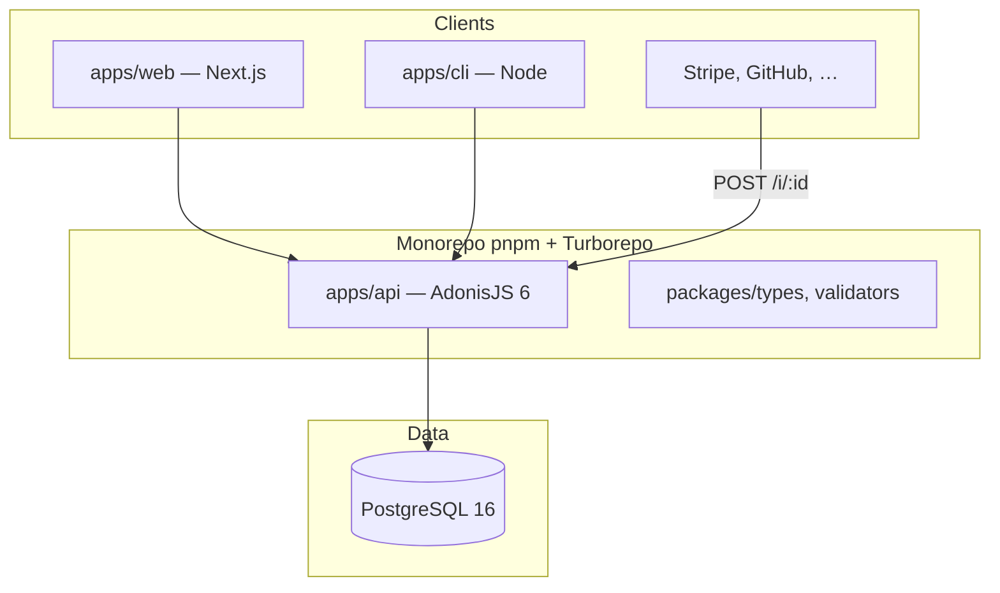
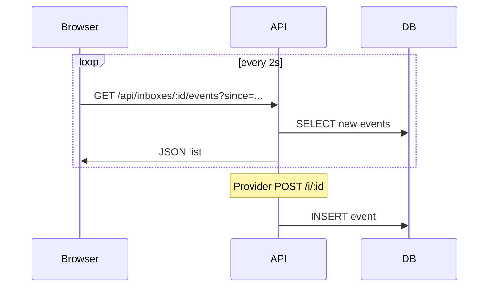

# Stack technique — Hookvane

Décisions pour le MVP et évolution V1+. Dernière révision : juin 2026.

## Vue d'ensemble



## Principes de choix

1. **TypeScript partout** — types partagés API ↔ web ↔ CLI
2. **Monolithe API** — pas de microservices au MVP
3. **Peu de moving parts** — pas de Docker, pas de Redis au MVP, reporter BullMQ / tunnel / SDK
4. **Ingest ultra-rapide** — écriture DB synchrone, réponse 200 en < 100 ms
5. **DX familière** — profil équipe : Adonis + Next (déjà exploré sur PulseSend)

---

## Monorepo

| Choix | Technologie | Pourquoi |
|-------|-------------|----------|
| **Workspaces** | **pnpm** | Rapide, strict, standard monorepo |
| **Orchestration** | **Turborepo** | Cache builds, pipelines `dev` / `build` / `test` |
| **Runtime** | **Node 22 LTS** | Supporté par Adonis 6 et Next 15 |
| **Langage** | **TypeScript 5.7+** | Strict mode |

### Structure validée

```
hookscope/
├── apps/
│   ├── api/                 # AdonisJS 6
│   ├── web/                 # Next.js 15
│   └── cli/                 # Phase 2 MVP (semaine 4)
├── packages/
│   ├── types/               # DTOs, enums, error codes
│   ├── validators/            # Schémas partagés (Zod)
│   └── tsconfig/              # bases TS partagées
├── turbo.json
└── pnpm-workspace.yaml
```

### Scripts racine (cible)

```json
{
  "dev": "turbo dev",
  "build": "turbo build",
  "test": "turbo test",
  "lint": "turbo lint",
  "db:migrate": "pnpm --filter @hookscope/api db:migrate"
}
```

---

## API — `apps/api`

| Couche | Choix | Alternative écartée |
|--------|-------|---------------------|
| Framework | **AdonisJS 6** | Hono (trop bas niveau), Nest (lourd), Elysia (écosystème) |
| ORM | **Lucid** (inclus) | Prisma (doublon avec Lucid Adonis) |
| Validation | **VineJS** (inclus) | Joi, class-validator |
| Auth | **Adonis Auth** (access tokens) | Passport, Lucia seul |
| HTTP client (replay) | **undici** (`fetch` natif Node) | axios |
| IDs | **ULID** (`ulid` package) | UUID, nanoid |
| Tests | **Japa** (inclus Adonis) | Vitest seul sur API |

### Pourquoi AdonisJS

- TypeScript natif, batteries incluses (auth, validation, ORM, config)
- Tu as déjà l'expérience via la réflexion PulseSend / Adonis
- Middleware + services = bon fit ingest / replay / auth
- Pas besoin de coller 15 libs comme avec Hono nu

### Routes (deux surfaces)

| Surface | Auth | Exemple |
|---------|------|---------|
| **Ingest** | Aucune (inbox ID secret) | `POST /i/:inboxId` |
| **Dashboard API** | Bearer access token | `POST /api/events/:id/replay` |

### Ingest — contraintes perf

- Body raw lu une fois, stocké en `text` + `jsonb` si JSON
- Index : `(inbox_id, received_at DESC)`
- Pas de queue sur ingest MVP — insert synchrone
- Limite body : **1 MB** (middleware)

### Replay — MVP vs V1

| Phase | Comportement |
|-------|----------------|
| **MVP** | Replay **synchrone** dans la requête HTTP (timeout 30 s) |
| **V1** | Replay async via **BullMQ** si timeout / retry / bulk |

BullMQ **hors MVP initial** — ajouter quand replay async requis.

---

## Web — `apps/web`

| Couche | Choix | Alternative écartée |
|--------|-------|---------------------|
| Framework | **Next.js 15** App Router | Remix, Nuxt |
| Styling | **Tailwind CSS 4** | CSS modules seuls |
| Composants | **shadcn/ui** | Mantine, Chakra |
| Fonts | **Cormorant Garamond** + **Lora** + **Inter** | — |
| Data fetching | **fetch** + React Query (**TanStack Query v5**) | SWR |
| Temps réel | **Polling** (TanStack Query `refetchInterval`) | SSE in-process (V1, instance unique) |
| Tests | **Vitest** + Testing Library | Playwright (E2E V1) |

### Pourquoi Next.js

- Landing + dashboard + docs dans une app
- Déploiement Vercel trivial
- Projet **from scratch** — aucun code repris de `pulse-send`
- SEO docs / marketing

### Pages MVP

```
/                    → landing
/i/[id]              → inbox (cœur produit)
/share/[token]       → event partagé
/login, /register    → auth
/dashboard           → liste inboxes
/docs/*              → MDX ou content layer (V1.1)
```

### Appels API

- Server Components pour landing / SEO
- Client Components pour inbox live (polling + replay UI)
- `NEXT_PUBLIC_API_URL` → `http://localhost:3333` en dev

---

## CLI — `apps/cli` (fin MVP)

| Couche | Choix |
|--------|-------|
| Framework CLI | **citty** + **unjs/consola** ou **Commander** |
| Build | **tsup** → binaire ESM |
| Publish | `npx @hookscope/cli` (V1 npm) |

Commandes cibles :

```bash
hookscope inbox create
hookscope events list --inbox <id>
hookscope replay <eventId> --to <url>
```

---

## Packages partagés

### `packages/types`

```ts
// Exemples
export type InboxId = string
export type EventId = string
export type ReplayErrorCode = 'CONNECTION_REFUSED' | 'TIMEOUT' | 'DNS_ERROR'
export interface ApiResponse<T> { success: true; data: T } | { success: false; error: ApiError }
```

### `packages/validators`

- **Zod** — schémas partagés web (formulaires) + import possible côté CLI
- VineJS reste côté API (Adonis) — duplication minimale via types générés ou schémas miroir

---

## Base de données

**Pas de Docker** — PostgreSQL installé nativement ou hébergé cloud dès le dev.

| Choix | Détail |
|-------|--------|
| Moteur | **PostgreSQL 16** |
| **Dev local** | Postgres **système** (`apt` / `brew`) **ou** [Neon](https://neon.tech) free tier (URL dans `.env`) |
| **Prod** | Neon, Supabase ou Railway add-on |
| Migrations | Lucid migrations |
| JSON | `jsonb` pour headers, query, metadata |
| Tests API | SQLite `:memory:` ou PG de test dédié (Japa / Adonis) |

### Setup dev sans Docker (Linux)

```bash
# PostgreSQL natif (ex. Ubuntu)
sudo apt install postgresql postgresql-contrib
sudo -u postgres createuser -s "$USER" || true
createdb hookscope_dev

# .env apps/api
DB_HOST=127.0.0.1
DB_PORT=5432
DB_USER=postgres
DB_PASSWORD=
DB_DATABASE=hookscope_dev
```

### Alternative dev 100 % cloud

Une seule `DATABASE_URL` Neon — même URL pour toute l'équipe, zéro install locale.

### Tables MVP

```sql
users
inboxes          -- id, user_id nullable, name, default_replay_url, expires_at
events           -- inbox_id, method, path, headers jsonb, body_text, body_json jsonb, ...
replays          -- event_id, target_url, status, response_*, duration_ms, error jsonb
share_tokens     -- event_id, token, expires_at
access_tokens    -- Adonis auth
```

Pas de `teams` au MVP — `user_id` sur inbox suffit.

---

## Redis — pas au MVP

**Pas de Redis en local, pas de Docker Redis.**

| Besoin | Solution MVP | Plus tard (scale) |
|--------|--------------|-------------------|
| Inbox live | **Polling** 2–3 s (`refetchInterval`) | SSE in-process ou Upstash |
| Rate limiting | **Memory store** Adonis limiter | Redis / Upstash |
| Replay queue | **Sync HTTP** | BullMQ + Upstash (V2) |
| Cache | — | Redis si besoin |

Redis n'entre dans la stack **que** quand tu scales (multi-instance API, BullMQ). Jusque-là : Postgres + mémoire suffisent.

---

## Temps réel (inbox live)



**Choix MVP** : polling uniquement — simple, zéro infra extra, suffisant pour inbox debug.

**V1 optionnel** : SSE sur **une seule instance** API (EventEmitter in-process), sans Redis.

---

## Auth

| Phase | Mécanisme |
|-------|-----------|
| Inbox anonyme | `inbox_id` nanoid 12–16 chars — secret par obscurité |
| Compte user | Email + password (Adonis `@adonisjs/auth`) |
| API dashboard | **Access token** Bearer |
| CLI | Token stocké `~/.hookscope/config` |

Pas de OAuth social au MVP.

---

## Sécurité

| Règle | Implémentation |
|-------|----------------|
| Rate limit ingest | 100 req/min/inbox — `@adonisjs/limiter` **memory** store |
| Rate limit replay | 10/min/user |
| SSRF replay | MVP : autoriser URLs publiques ; bloquer `169.254.0.0/16`, metadata cloud ; localhost documenté comme limité |
| CORS | Web origin only sur `/api/*` |
| Headers stockés | Sanitize `authorization`, `cookie` → `[REDACTED]` option stockage |

---

## Observabilité

| Couche | Outil |
|--------|-------|
| Logs | **Pino** (Adonis default) — JSON structuré |
| Erreurs | **Sentry** (V1) |
| Métriques | Vercel Analytics (web) + logs API (MVP) |
| Health | `GET /health` |

---

## Tooling dev

| Outil | Usage |
|-------|-------|
| **ESLint 9** flat config | Lint monorepo |
| **Prettier** | Format |
| **Husky** + **lint-staged** | Pre-commit (optionnel MVP) |
| **.env.example** | racine monorepo (`hookscope/.env`) |

**Pas de Docker** pour Postgres ni Redis — install native ou DB cloud (Neon).

### Ports locaux

| Service | Port |
|---------|------|
| API Adonis | `3333` |
| Next.js | `3000` |
| PostgreSQL (si local) | `5432` |

---

## Hébergement — c'est quoi ?

Tu as **3 briques** à héberger pour Hookvane :

| Brique | Rôle | Où ça tourne |
|--------|------|----------------|
| **web** | Next.js (landing, inbox UI) | **Vercel** |
| **api** | AdonisJS (ingest + replay) | **Railway** ou **Fly.io** |
| **postgres** | Données | **Neon** (recommandé) |

### Vercel — le site Next.js

- Créateurs de **Next.js** — deploy en `git push`
- Gratuit pour hobby, previews par PR
- **Ne convient pas** pour l'API Adonis long-running (timeout serverless ~10–60 s)

### Railway — PaaS simple (« Heroku moderne »)

- Tu connectes GitHub → Railway build et run ton app Node
- **Très simple** : un dashboard, variables d'env, logs
- Facturation à l'usage (~5–20 $/mois pour une petite API)
- Bon pour **MVP solo** : tu veux shipper vite sans apprendre l'infra

```
GitHub push → Railway détecte apps/api → node server.js → URL publique
```

### Fly.io — conteneurs légers près des users

- Tu déploies une **app containerisée** sur des « machines » réparties dans le monde
- Plus de contrôle (régions, scaling, networking)
- Courbe d'apprentissage **un peu plus haute** (`fly.toml`, Dockerfile parfois)
- Utile si tu veux choisir la **région** (latence) ou scaler finement

```
fly deploy → image Docker (ou buildpack) → VM Fly en région choisie
```

### Comparaison rapide (API Hookvane)

| | **Railway** | **Fly.io** |
|--|-------------|------------|
| Simplicité | ⭐⭐⭐⭐⭐ | ⭐⭐⭐ |
| Prix MVP | ~5–15 $/mois | ~5–10 $/mois |
| Config | Quasi zero | `fly.toml` |
| Docker requis | Non (souvent) | Parfois oui |
| Bon pour | **Premier deploy, solo dev** | Scale régional plus tard |

**Recommandation Hookvane** : **Railway** pour l'API au MVP — moins de friction. Fly reste une option si tu veux apprendre ou cibler une région précise.

### Neon — PostgreSQL managé

- Base **PostgreSQL dans le cloud** — pas d'install, pas de Docker
- Free tier généreux pour dev + petit prod
- Tu copies `DATABASE_URL` dans Railway (API) — c'est tout

```
apps/api (.env)  →  DATABASE_URL=postgresql://...@neon.tech/hookscope
```

## Déploiement (cible)

| App | Plateforme | Pourquoi |
|-----|------------|----------|
| **web** | **Vercel** | Next.js natif |
| **api** | **Railway** ✓ | Process Node permanent, ingest + replay |
| **postgres** | **Neon** | PG managé, dev + prod |
| **redis** | — | Post-MVP seulement |

### DNS cible

```
hookscope.dev        → Vercel (web)
api.hookscope.dev    → Railway (api)
```

Ingest peut passer par `hookscope.dev/i/*` (rewrite vers API) ou directement `api.hookscope.dev`.

**Recommandé MVP** : `api.hookscope.dev/i/:id` pour ingest + CORS simple, ou rewrite Next :

```js
// next.config — rewrite ingest vers API
{ source: '/i/:path*', destination: 'https://api.hookscope.dev/i/:path*' }
```

---

## CI/CD (V1)

| Étape | GitHub Actions |
|-------|----------------|
| PR | lint + typecheck + test (turbo) |
| main | deploy preview web + api staging |
| tag | deploy prod |

Pas obligatoire semaine 1.

---

## Stack par phase

### Phase 0 — Semaine 1 (slice vertical)

- [x] Décisions ci-dessus
- [ ] pnpm + turbo + Postgres (native ou Neon)
- [ ] Adonis : `POST /i/:id` + Lucid + 1 migration
- [ ] Next : page `/i/[id]` + polling (pas SSE obligatoire jour 1)
- [ ] Pas de auth, pas de CLI, pas de BullMQ

### Phase 1 — Semaine 2–3

- [ ] Replay synchrone + UI response
- [ ] Auth + dashboard
- [ ] Polling optimisé (`since` cursor) — SSE optionnel sans Redis
- [ ] Share links

### Phase 2 — Semaine 4

- [ ] CLI minimal
- [ ] Rate limiting
- [ ] Deploy Railway (api) + Vercel (web) + Neon (db)

### Phase 3 — Post-MVP

- [ ] BullMQ replay async (+ Upstash Redis si besoin)
- [ ] Tunnel `hookscope listen`
- [ ] SDK npm `@hookscope/sdk`
- [ ] Sentry, Playwright E2E
- [ ] Stripe billing

---

## Alternatives globales (rappel)

| Stack alternative | Pourquoi pas (pour Hookvane) |
|-------------------|-------------------------------|
| **Hono + Prisma** | Plus de assembly manuel, moins d'auth batteries |
| **Remix + Express** | Moins aligné avec expérience récente |
| **Supabase seul** | Ingest custom + replay HTTP mal adapté à Edge-only |
| **Go / Rust API** | Rupture stack TS, CLI/web moins partagés |
| **PHP Laravel** | Tu pars sur greenfield TS |

---

## Décisions ouvertes (à trancher)

| # | Question | Options | Recommandation |
|---|----------|---------|----------------|
| 1 | Package manager | pnpm vs bun | **pnpm** (turbo docs, stable) |
| 2 | Ingest URL | rewrite Next vs sous-domaine API | **Rewrite** `hookscope.dev/i/*` — UX propre |
| 3 | Temps réel | polling / SSE | **Polling** MVP, pas de Redis |
| 7 | Postgres dev | native / Neon | **Neon** si zéro install, sinon `apt install postgresql` |
| 4 | API host | — | **Railway** ✓ validé |
| 5 | UI kit | shadcn vs custom | **shadcn** — vitesse + accessibilité |
| 6 | Codebase | — | **100 % greenfield** — repo `hookscope/` seul, pas de `pulse-send` |

---

## Résumé une ligne

> **Greenfield · pnpm · Adonis 6 · Next 15 · Neon (PG) · pas de Docker/Redis MVP · Vercel (web) + Railway (api).**